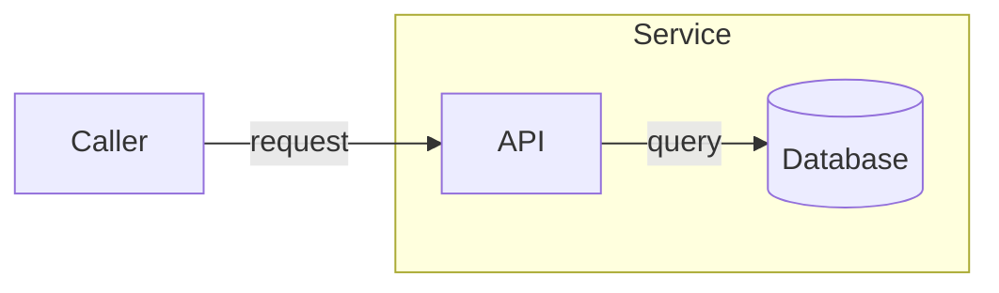
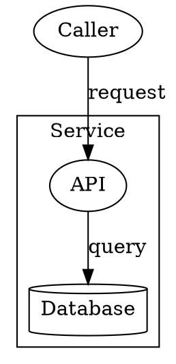

# Formats & interoperability

Threat Model Forge keeps one **canonical, `.tm7`-shaped in-memory model** and maps every file format
to and from it through a pluggable format layer. New formats plug in without changing the tools that
consume them, and each provider declares how faithfully it round-trips.

## Supported formats

| Format id | Extension | Display name | Read | Write | Round-trips |
| --- | --- | --- | :---: | :---: | :---: |
| `tm7` | `.tm7` | Microsoft Threat Modeling Tool | Yes | Yes | Lossless |
| `tmforge-json` | `.tmforge.json` | Threat Model Forge JSON (canvas wire model) | Yes | Yes | Structural |
| `drawio` | `.drawio` | draw.io / diagrams.net | Yes | Yes | Structural |
| `vsdx` | `.vsdx` | Microsoft Visio | Yes | Yes | Structural |
| `threat-dragon` | `.json` (content-detected) | OWASP Threat Dragon v2 | Yes, bounded subset | No | Import only |
| `mermaid` | `.mmd`, `.mermaid` | Mermaid flowchart | Yes, bounded subset | No | Import only |
| `dot` | `.dot`, `.gv` | Graphviz DOT | Yes, bounded subset | No | Import only |

List these at runtime with `tmforge` (via conversion targets) or the API's `GET /v1/formats`, which
returns each provider's capabilities and fidelity note.

## Fidelity

"Round-trips" means reading a file and writing it back reproduces the source **without loss**. Only
`.tm7` does this.

### `tm7` (lossless)

Byte-stable round-trip via .NET's `DataContractSerializer` over the full model graph. Because
Threat Model Forge reuses the exact serializer type graph MTMT produces, `.tm7` files move between the
two tools **byte-for-byte identically**, including the rich threat data model. This is the canonical
format; when you mutate a `.tm7` with the CLI, it's written back through this byte-stable writer.

### `tm7` and the Microsoft Threat Modeling Tool

For a file to open in MTMT it must carry a **knowledge base** (the tool dereferences it without a null
check). So when you export a model that doesn't already have one, Threat Model Forge embeds its own
clean-room default — **“Threat Model Forge Core”**: the generic DFD element types, the six STRIDE
categories, a threat type per built-in rule, and a **standard element type for every authoring
stencil** so the tool's palette mirrors Threat Model Forge's. This happens on **every** `.tm7` write
(the CLI authoring verbs, `convert --to tm7`, and Studio/API export), so a `.tm7` is MTMT-ready at
every step.

- **Typed properties.** Schema properties (`Protocol`, `Encrypted`, `DataType`, …) are written as
  first-class **typed tool properties** — the drop-downs MTMT shows in its properties pane — rather
  than free-form custom attributes. Free-text properties (like `Port`) and any value outside a
  property's options are kept as custom attributes, so nothing is dropped.
- **Stencils as element types.** An element placed from a stencil (`azure-sql`, `entra-id`, …) is
  exported as the matching standard element type, so it appears in MTMT as that stencil rather than a
  bare generic.
- **Existing knowledge bases are preserved.** A model that already carries a knowledge base — a file
  authored in MTMT, or one you supply with `tmforge convert --knowledge-base <file.tb7>` — is written
  back untouched.

Analysis reads typed and custom properties identically, so an exported or tool-authored `.tm7` is
validated the same as one authored with custom attributes.

### `tmforge-json` (canonical wire model)

The shape Studio and the API speak: elements, flows, trust boundaries, names, and geometry, plus an
optional analysis selection (disabled packs/rules) and an author-owned threat overlay, risk
acceptance, and per-threat edits (state, priority, mitigation, description), plus manually-authored
threats. An optional `metadata` object retains the model name, owner, description, contributors, and
reviewer. Imported manual threats carry informational provenance in their optional `source` object.
Multi-page models carry a `diagrams` array (one entry per page, with its name); a named or explicitly
identified single page also retains that array. The flat `elements`/`flows` mirror the first page for
older readers, and legacy flat documents remain readable. Knowledge-base
attributes and the full generated-threat register are not represented, the register is regenerated
from the rules on demand, and only the author-owned overlay round-trips so it's structural rather
than lossless. Use it to bridge Studio and the CLI.

### `drawio` (draw.io / diagrams.net)

A structural mapping to and from mxGraph: nodes, flows, trust boundaries, names, and geometry, with
each draw.io page mapped to a diagram. Import recognizes the shapes this provider writes and its
documented style convention. Knowledge-base attributes and generated threats are not represented.

### `vsdx` (Microsoft Visio)

Editable Visio via template injection. **Every diagram (page) is exported as its own Visio page and
re-imported**, so multi-page models keep their pages. Structure (nodes, flows, trust boundaries,
names, geometry) is preserved; element custom properties and associated threats are written as
per-shape **Visio Shape Data** (visible in Visio's Shape Data pane) and re-imported as custom
properties. The rich threat model itself is not reconstructed, so the mapping is structural. Import
recognizes packages this provider wrote and the documented master/shape convention.

### `threat-dragon` (OWASP Threat Dragon v2 import)

This is a **read-only, bounded import**, not native Threat Dragon editing or a lossless conversion.
The reader recognizes the `summary` / `detail.diagrams` JSON envelope and accepts major version 2.
It does not claim the generic `.json` extension, execute foreign rules, or fetch external resources.
An unsupported construct refuses the entire import rather than returning a partial diagram.

**Preserved:** named pages and stable identities; actors, processes, stores and rectangular trust
boundaries; directed, page-local flows; model title/owner/description/contributors/reviewer; and
authored threats with title, description, category, mitigation, priority, supported state and scope.
Both `data.threats` and the cell-level `threats` schema variant are accepted, but two nonempty threat
arrays on the same cell are ambiguous and refused.

Imported threats use `manual:threat-dragon.<source-id>` keys and remain independent of generated
tmforge threats. Source format/version, threat/cell/diagram ids, methodology, original status,
severity and custom score are retained as provenance. Non-STRIDE category text is preserved, not
coerced into STRIDE; importing a LINDDUN category does not install a LINDDUN evaluator. Source ids
must fit the manual-id vocabulary; malformed or duplicate identities are refused.

**Control mapping:** explicit store booleans map `storesCredentials` to `StoresCredentials`, `isALog`
to `StoresLogData`, `isSigned` to `Signed`, and `isEncrypted` to `Encrypted=At-rest` or `No`.
Actor `providesAuthentication` maps to `AuthenticatesItself`; flow `protocol` is preserved verbatim.
Missing values remain missing. Flow encryption alone does not invent a protocol such as TLS.
Other cell data is preserved under `ThreatDragon.data.*`, alongside source identity properties.
**Out-of-scope flags are retained as information, not applied as tmforge suppressions.** The imported
model is analyzed under the selected tmforge rules, not Threat Dragon's detection semantics.

**Refused in this first delivery:** curved/line trust boundaries, unknown cell kinds, bidirectional
or detached flows, cross-page endpoints, fractional/out-of-range rectangles, and unmappable threat
statuses or priorities. Supported statuses are `Open`, `Mitigated`, and `Accepted`; supported
priorities are `Critical`, `High`, `Medium`, and `Low`. For example, `NA`, `Transferred`, `Avoided`
and `Eliminated` are not silently rewritten to `Accepted`. Geometry must use integer coordinates
within +/-1,000,000 and dimensions from 1 to 100,000; rounding could alter a trust claim.

Limits are 8 MiB of UTF-8 JSON, depth 64, 128 diagrams, 10,000 cells, and 20,000 authored threats.
Style, thumbnails, free-form routing/vertices and unlisted document fields are not retained.
Keep the original file. In particular, the upstream v2 demo includes curved boundaries and is
deliberately refused by this first delivery; replacing those boundaries requires a human review,
not automatic conversion to rectangles.

```bash
tmforge open dragon.json
tmforge convert dragon.json --to tmforge-json --out imported.tmforge.json
tmforge convert dragon.json --to tm7 --out imported.tm7
```

Studio **Open File**, the HTTP read endpoint, WASM and MCP use the same reader. Studio detaches the
source file handle and proposes a new `.tmforge.json` name for Save. Native `--to threat-dragon`
output is refused without overwriting the destination. Schema/sample grounding uses
[Threat Dragon v2.6.2](https://github.com/OWASP/threat-dragon/tree/v2.6.2/ThreatDragonModels); tests use
a synthetic fixture covering the supported subset, not a claim that every v2 model is importable.

### `mermaid` and `dot` (starter-model import)

Import an existing architecture diagram through the same readers used by Studio, HTTP, WASM and
MCP. No Mermaid runtime, Graphviz executable, network access or additional package is required.
These formats are **input-only**; save the resulting model as `tmforge-json` or `tm7`.

```bash
tmforge preflight architecture.mmd --to tmforge-json
tmforge convert architecture.mmd --to tmforge-json --out architecture.tmforge.json
tmforge convert architecture.dot --to tm7 --out architecture.tm7
tmforge analyze architecture.tm7
```

**Mapping and evidence:** source nodes become processes by default. Mermaid cylinders (`id[(Label)]`)
and DOT `shape=cylinder` become data stores. A Mermaid inline class `:::process`, `:::store`,
`:::datastore` or `:::external`, or a DOT `kind` attribute with one of those values, explicitly
selects the DFD kind. Kind annotations take precedence over shape hints. Names such as "User",
"Database" or "HTTPS" do not establish a kind or a security control.

Directed edges become flows. Named Mermaid subgraphs and DOT `subgraph cluster_*` groups become
rectangular trust boundaries, including nesting. This is a **modeling assumption, not proof of
enforced isolation**: review the imported boundaries. A node cannot belong to unrelated sibling
groups, and edges to subgraphs rather than component nodes are refused.

Control-like properties whose schema permits `Unknown` are initialized to `Unknown`; free-text
properties remain unset. In particular, an edge labeled "HTTPS" still has `Protocol=Unknown`.
The model is analyzable immediately, but remains a skeleton requiring evidence and human review.
Preflight always reports `import.structural-mapping` so Studio asks for confirmation and CLI
`--fail-on-loss` refuses it before writing.

**Supported Mermaid subset:** one `flowchart` or `graph` with `LR`, `RL`, `TB`, `TD` or `BT`;
newline/semicolon-separated statements; `%%` comments; bare nodes and plain/quoted labels;
rectangle, rounded, stadium, subroutine, circle, diamond, hexagon and cylinder syntax;
directed `-->`, `-.->` and `==>` edges, chains, `-->|label|`, `-- label -->`, `-. label .->`
and `== label ==>`; `subgraph id [Label]` or `subgraph id`, closed by `end`; and subgraph
`direction`. A single fenced `mermaid` block is accepted, without surrounding Markdown.



**Supported DOT subset:** a non-strict `digraph`, optionally named; case-insensitive keywords;
plain/numeric or double-quoted identifiers; `//` and `/* ... */` comments; directed `->` edges
and chains; repeated node declarations; nested, uniquely named `cluster_*` subgraphs; bracketed
attributes and graph assignments. Node/edge defaults are scoped and apply when an object is first
created; graph labels are inherited when a subgraph is created. Labels support escaped quotes,
backslashes and `\n`/`\l`/`\r` line breaks. Quoted identifiers accept escaped quotes, but other
identifier escapes are refused rather than reinterpreted.



DOT maps `label`, node `kind`/`shape`, and optional explicit edge `id`. `dir` must be `forward`.
The accepted basic shapes are `box`, `rect`, `rectangle`, `ellipse`, `circle`, `doublecircle`,
`diamond`, `hexagon`, `oval`, `plaintext`, `plain`, `none`, and `cylinder`.
Accepted presentation-only attributes are `color`, `fontname`, `fontsize`, `fontcolor`, `penwidth`,
`style`; graph `rankdir`, `ranksep`, `nodesep`, `bgcolor`, `labelloc`, `labeljust`; node `fillcolor`,
`width`, `height`, `fixedsize`, `margin`; and edge `arrowhead`, `arrowsize`, `constraint`, `weight`,
`minlen`. These are deliberately not retained, and `style=invis` is refused.

**Refused:** other Mermaid diagram grammars, front matter, initialization/styling/click directives,
unlisted classes or shape syntax, Markdown/HTML/entity labels, edge IDs/metadata, grouped endpoints,
invisible/undirected/bidirectional or extended-length links; DOT strict/undirected graphs,
anonymous/non-cluster/reopened subgraphs, endpoint sets, ports/compass points, HTML/record shapes,
string concatenation, dynamic label escapes such as `\N`, preprocessor lines and unlisted attributes
(including URLs and images). Unsupported syntax refuses the whole import with a line, column and
specific reason. Nothing executes embedded callbacks or resolves external resources.

**Identity and geometry:** page, node and boundary IDs use `DeterministicGuid` with distinct source
namespaces, so relabeling does not renumber objects. Nodes retain `Source.Format` and `Source.Id`.
DOT edge `id` is preferred when present, must be unique, and cannot label an entire chain.
Otherwise flow identity uses the ordered source/target IDs plus the occurrence within that pair.
Unrelated edges do not renumber existing flows; reordering parallel same-endpoint edges can, so use
explicit DOT edge IDs when those flows need independent stable identity. Reimport is not a merge
with an edited model: retain the canonical model and use diff/compare to review source changes.

The existing deterministic layout engine regenerates geometry while preserving nested membership.
Source direction, dimensions, colors, line styles and routing are not reproduced. Two imports of
identical input produce byte-identical native output. Limits are 8 MiB of strict UTF-8 (optional
BOM), 256 nodes plus boundaries, 512 edges, 16 nested subgraphs, 2,048 characters per identifier or
label, 10,000 statements and 128 assignments per attribute-list sequence. Content detection examines
the first 4 KiB; use an explicit preflight format for a source with a longer comment preamble.

## Preflight and import diagnostics

Run `tmforge preflight <file> [--to <format>]` before migrating a model. It inspects raw input before
deserialization can hide misspelled fields, duplicate identities, or unresolved flows, then reports
known losses for the selected destination. Preflight is **document validation, not security
analysis**. A passing result does not claim that the design is secure or every foreign extension
can round-trip.

- Canonical JSON rejects duplicate JSON fields, empty or colliding page/element/flow identities,
  unknown element kinds, invalid field types, incomplete component sizes, and dangling/cross-page
  flows. References are checked before any connector can disappear during reconstruction.
- Manifest JSON rejects unknown fields, including `properties` where `props` is required. Custom
  keys inside `props` remain governed by existing property policy. `--force` does not bypass field
  spelling or JSON integrity checks. Legacy unversioned manifests remain supported when explicitly
  selected.
- Canonical extension fields remain readable for compatibility, but receive path-specific warnings
  that they are not represented by the engine and may be lost on conversion. Studio's existing
  flow handles and label offsets, custom property bags, and expected rule-pack fingerprints are
  recognized fields, not spelling errors.
- Draw.io input with missing/compressed graph content is refused rather than imported as an empty
  diagram. Use an uncompressed XML export. Duplicate cells and broken attached-flow endpoints are
  refused; preflight names free-standing lines omitted by the reader and unfamiliar shapes whose
  kinds are inferred.
- Visio preflight names shapes treated as annotations rather than model objects. Invalid/duplicate
  shape ids and broken connector attachments are refused; the existing bounded page-catalog and
  archive checks remain in force.

Conversion diagnostics identify known losses such as line boundaries and embedded knowledge bases
when projecting into canonical JSON; threat-register, property, identity and metadata loss when
exporting diagrams; rule settings not carried by a conversion; and TM7 coordinate translation.
These are conservative checks of the supported mappings, not a complete semantic diff or an
openability guarantee from another product. Retain the source document when warnings apply.

The command, API, WASM and MCP return the same diagnostic codes, severities, paths and messages.
Studio reviews warnings before **Open File**, **Save** with an engine, or **Export** continues;
blocking errors cannot be accepted. Rejection and cancellation leave the current workspace
unchanged. Native JSON saves retain the Studio wire model rather than performing a format
conversion, so they do not warn about losing their own analysis settings.

Preflight and CLI conversion accept at most 8 MiB of source content. Canonical JSON reads are strict
UTF-8 with an optional BOM and a nesting limit of 64. At most 100 diagnostics are returned, with an
explicit error if the diagnostic budget is exhausted. Correct the reported problems and rerun.

## Converting

### CLI

```bash
tmforge convert <input> --to <format> --out <path>
```

The target is chosen by `--to`, or inferred from the `--out` extension.

Errors found by preflight block conversion before the output file is opened. Warnings are emitted
before writing and included in `--json` output. Use `--fail-on-loss` to refuse warnings as well, or
the read-only `preflight --to` command to review them first. Existing source and output files are
not changed by preflight or by a refused conversion.

```bash
tmforge convert model.tm7 --to drawio --out model.drawio
tmforge convert model.tm7 --to vsdx   --out model.vsdx
tmforge convert model.drawio --to tm7 --out model.tm7
tmforge convert model.tm7 --to tmforge-json --out model.tmforge.json
```

See the [CLI reference](cli-reference.md#convert).

### API

```http
POST /v1/model/convert?to=<format>     # convert to any format
POST /v1/model/export/tm7              # export a .tm7 specifically
POST /v1/detect                        # sniff a file's format from its bytes
```

See the [API reference](api-reference.md).

### Studio

Studio round-trips through `tmforge-json`. **Open File** uses the active API or in-browser WASM
engine to read `.tm7`, `.drawio`, `.vsdx`, supported Threat Dragon JSON, Mermaid and DOT. Read-only inputs save
as new tmforge files, not back to their original format. The browser canvas itself does not parse
foreign file formats. See the [Studio guide](studio-guide.md#importing-and-exporting).

## Choosing a format

| Goal | Use |
| --- | --- |
| Exchange with the Microsoft Threat Modeling Tool, or store the source of truth | `tm7` |
| Move a diagram between Studio and the CLI/API | `tmforge-json` |
| Share an editable diagram with draw.io / diagrams.net users | `drawio` |
| Share an editable diagram with Visio users | `vsdx` |

> **Tip:** keep `.tm7` as your canonical, version-controlled source (it's lossless), and generate
> `.drawio` / `.vsdx` on demand for sharing. Converting *from* a structural format *to* `.tm7` only
> reconstructs the structure the source captured.

## Extending

Formats are pluggable: a provider implements the format contract (`Id`, extensions, capabilities,
read/write, and content sniffing) and registers with the format registry. The tools depend on the
registry rather than any single format, so adding one doesn't touch the CLI, API, or Studio.

## See also

- [CLI reference: `convert`](cli-reference.md#convert)
- [Engine API reference](api-reference.md)
